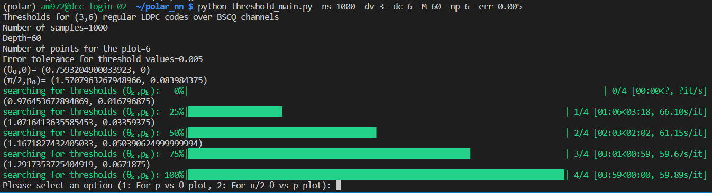

# PM-BPQM_BSCQ

The repository contains code to find the threshold for regular LDPC or LDGM code in the delta, gamma (or theta, p) parameter domain
for Binary Symmetric Classical Quantum channels.

For More Details follow- 'https://arxiv.org/pdf/2207.04984'

Run `python threshold_main.py` to determine the threshold in theta,p domain

For example to run (3,6) code with 1000 samples for Density evolution, depth 100 tree, 10 data points in the plot with error tolerance for threshold values being 0.001
use `python threshold_main.py -ns 1000 -dv 3 -dc 6 -M 100 -np 10 -err 0.001`.

See the following output log below-

