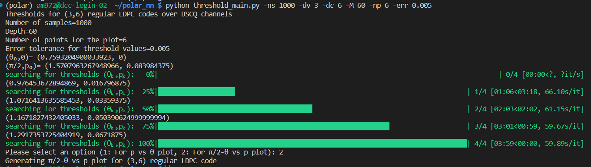

# PM-BPQM_BSCQ

The repository contains code to find the threshold for regular LDPC or LDGM code in the delta, gamma (or theta, p) parameter domain
for Binary Symmetric Classical Quantum channels.

Required packages are numpy,scipy,numba,matplotlib and tqdm.

For more details about this research follow- 'https://arxiv.org/pdf/2207.04984'

Run `python threshold_main.py` to determine the threshold in theta,p domain

For example to run (3,6) regular LPDC code with 1000 samples for Density evolution, depth 60 tree, 6 data points in the plot with error tolerance for threshold values being 0.005
use `python threshold_main.py -ns 1000 -dv 3 -dc 6 -M 60 -np 6 -err 0.005`.

See the following output log below-

The unicode characters have been used to print the results. If the unicode characters are not compatible with your system, change \u03B8 with theta, \u03C0 with pi to print
